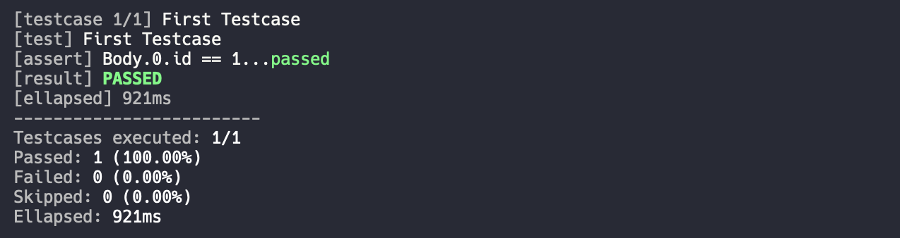

# Get Started

Cotton is a command line tool. You can install from package managers like homebrew or others, or build from [source](https://github.com/chonla/cotton).

## Installation

```bash
brew tap chonla/universe
brew install cotton
```

## First Testcase

Create a markdown file (text file with `.md` extension) with the following content.


# First Testcase

```http
GET https://fakestoreapi.com/products HTTP/1.1
```

* `Body.0.id`==`1`


## Execute Testcases

```sh
cotton
```

You should see the output like this in your terminal.

